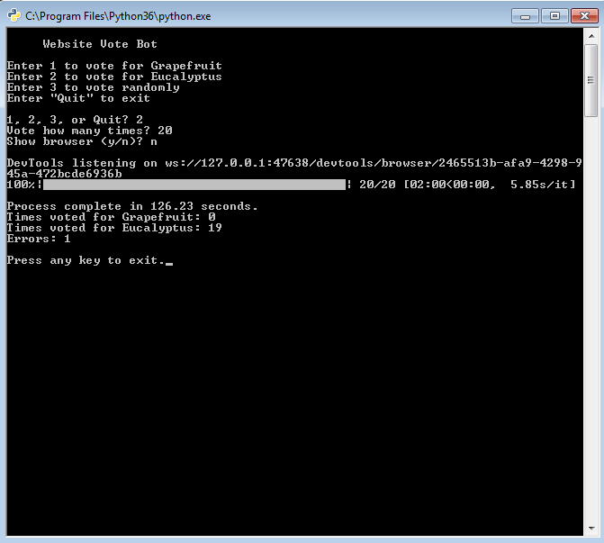

# Website Vote Bot

This script loops through the process of opening a webpage with a radio button poll, selecting an option, and submitting a vote. I got the idea to make this script because I noticed that the poll allowed an option to be chosen and submitted again after reloading the page, I understand that submitting multiple votes does not necessarily mean that each vote is counted.

I made this script, with much trial and error, before I learned about the DOM model and how JavaScript is used to manipulate it. 

Requires the Chrome browser to be installed and the chromedriver.exe to be in the same directory as this script.

## Python libraries required:
selenium

getch

tqdm

## Examples

### In Progress

### Complete

### Voting Randomly

